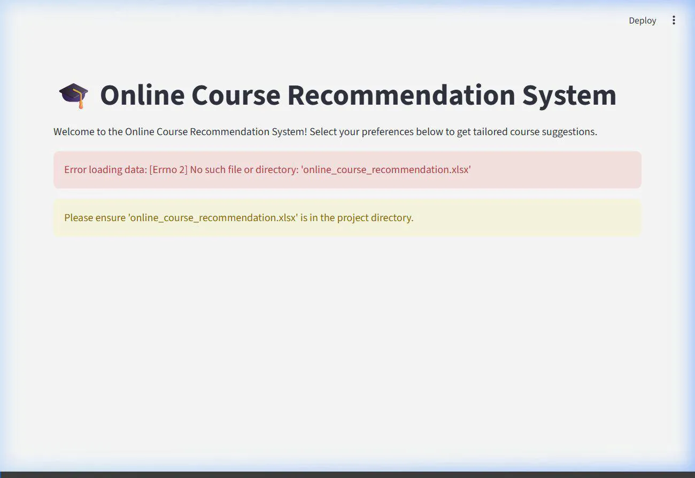

# Online Course Recommendation System

## Project Overview
This project builds a robust recommendation system designed to suggest online courses to users based on their interactions, preferences, and course attributes. The core objective is to enhance the user learning experience by providing personalized course recommendations, which in turn can increase user engagement and course completion rates.

## 🎥 Working Demo Trailer
Here is a demonstration of the interactive Streamlit application built for this course recommendation system:



## Detailed Explanation
The project includes both a Jupyter Notebook (`Recommendation_System_P2_V3_0 (3).ipynb`) and an interactive Streamlit Web App (`app.py`), following these key phases:

1. **Exploratory Data Analysis (EDA)**: 
   - We import libraries like Pandas, NumPy, Matplotlib, and Seaborn.
   - We load the dataset and analyze its shape and structure.
   - We explore the distribution of user ratings, course enrollments, and other interaction metrics to identify trends and outliers.

2. **Data Preprocessing**:
   - Handling missing values and removing duplicates.
   - Scaling numerical features using `StandardScaler`.
   - Encoding categorical variables using `OneHotEncoder`.
   - Creating a data pipeline to automate the transformation process.

3. **Recommendation Engine Building**:
   - Multiple recommendation techniques implemented: Popularity-Based, Rule-Based, Content/Metadata-Based, Semantic (TF-IDF + SVD), and Collaborative Filtering (User-User, Item-Item, Matrix Factorization).
   - Building a user-item interaction matrix.

4. **Model Evaluation & Web Deployment**:
   - Evaluated models using RMSE and MAE.
   - Built a Streamlit web application (`app.py`) allowing users to filter by difficulty level and ratings to receive real-time course recommendations and explore the underlying data.

## Project Structure
- `app.py`: Streamlit web interface for real-time course recommendations and exploration.
- `demo_trailer.webp`: Recorded demonstration video trailer showing the working web application.
- `Recommendation_System_P2_V3_0 (3).ipynb`: The comprehensive Jupyter notebook containing all code for EDA, preprocessing, models, and evaluations.
- `Online Course Recommendation System..1.pptx`: Presentation summarizing the project's goals, methodology, and results.

## Getting Started

### 1. Run the Web Application
```bash
pip install streamlit pandas numpy openpyxl
streamlit run app.py
```

### 2. Explore the Notebook
```bash
pip install pandas numpy scikit-learn matplotlib seaborn jupyter
jupyter notebook
```
Open and run `Recommendation_System_P2_V3_0 (3).ipynb` sequentially.
