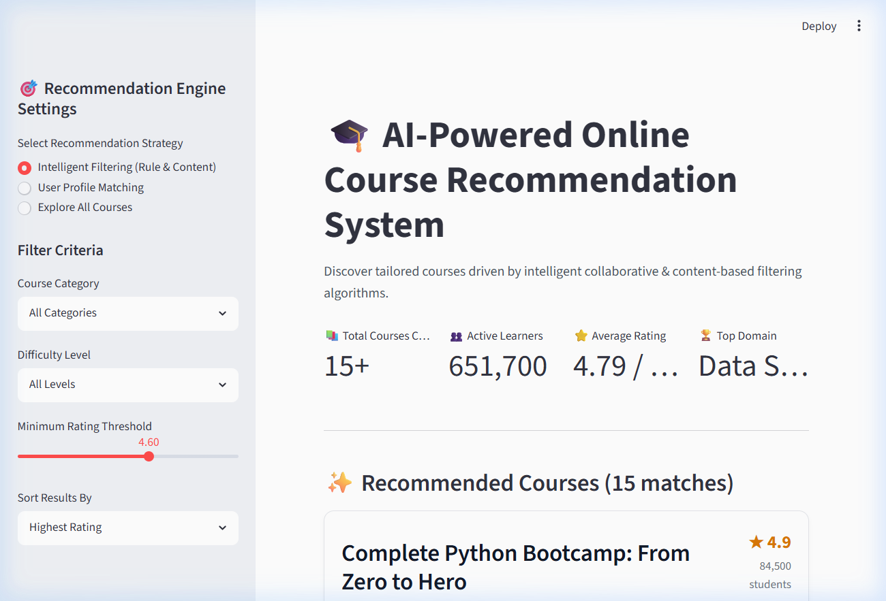
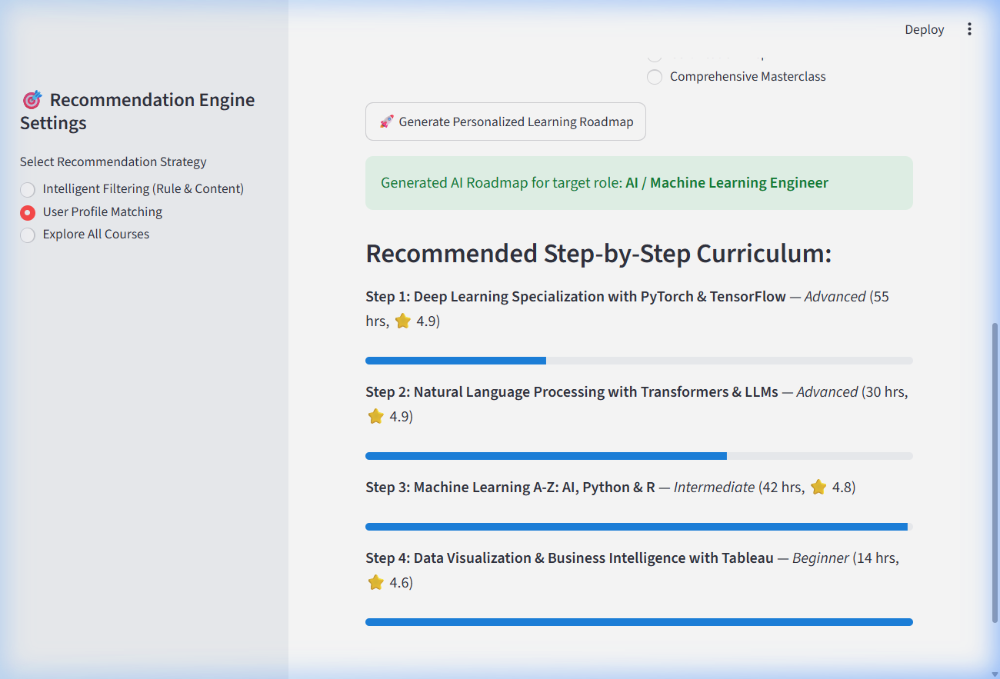
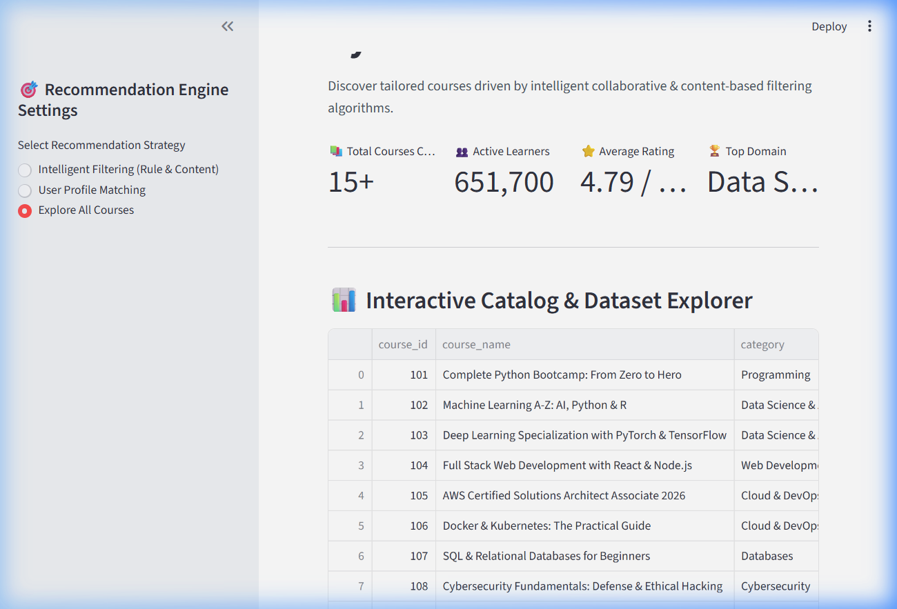

# Online Course Recommendation System

## Project Overview
This project builds an intelligent recommendation system designed to suggest online courses to users based on their interactions, career aspirations, and course attributes. The core objective is to enhance the user learning experience through tailored course recommendations, increasing engagement and course completion rates.

---

## 🎥 Working Application Demo Trailer
Below is the live working demonstration of the interactive Streamlit recommendation engine:


---

## 📸 Key Features & Visual Walkthrough

### 1. Interactive Recommendation Engine & Metrics
Users can filter courses by category, difficulty level, and minimum rating thresholds, with sorting by popularity or rating.


### 2. Personalized AI Career Roadmaps
Students can select their career path (e.g. AI / Machine Learning Engineer, Cloud Architect) to generate a step-by-step learning progression with progress tracking.


### 3. Interactive Dataset & Domain Analytics
Explore the entire course catalog with real-time domain and category distribution charts.


---

## 🧠 Detailed Technical Architecture
The project combines exploratory data analysis, machine learning algorithms, and interactive web application deployment:

1. **Exploratory Data Analysis (EDA)**: 
   - Uses Pandas, NumPy, Matplotlib, and Seaborn.
   - Evaluates distribution of ratings, enrollments, and course durations to uncover key student preferences.

2. **Data Preprocessing & Pipelines**:
   - Outlier detection and null handling.
   - Standard scaling for numerical features and one-hot encoding for categorical attributes.

3. **Recommendation Algorithms**:
   - **Popularity-Based Filtering**: Highlighting top-rated, highly enrolled foundational courses.
   - **Content-Based & Metadata Filtering**: Matching course tags, difficulty levels, and domain topics.
   - **Collaborative Filtering & Matrix Factorization**: Analyzing user-item interaction matrices using SVD and Cosine Similarity.
   - **Semantic Search**: Text vectorization using TF-IDF and truncated SVD.

4. **Web Deployment (Streamlit)**:
   - Real-time filtering and career path roadmap generation in a modern, responsive web application (`app.py`).

---

## 📂 Project Structure
- `app.py`: Streamlit web interface for real-time course recommendations and exploration.
- `demo_trailer.gif`: Animated demonstration video showing the working web application in real-time.
- `assets/`: High-resolution application screenshots for documentation.
- `Recommendation_System_P2_V3_0 (3).ipynb`: Full Jupyter notebook containing all EDA, ML modeling, and evaluations.
- `Online Course Recommendation System..1.pptx`: Presentation summarizing the project architecture and outcomes.

---

## 🚀 How to Run Locally

### 1. Run the Web Application
```bash
pip install streamlit pandas numpy openpyxl
streamlit run app.py
```
Open `http://localhost:8501` in your browser.

### 2. Run the Jupyter Notebook
```bash
pip install pandas numpy scikit-learn matplotlib seaborn jupyter
jupyter notebook
```
Open and execute `Recommendation_System_P2_V3_0 (3).ipynb`.
